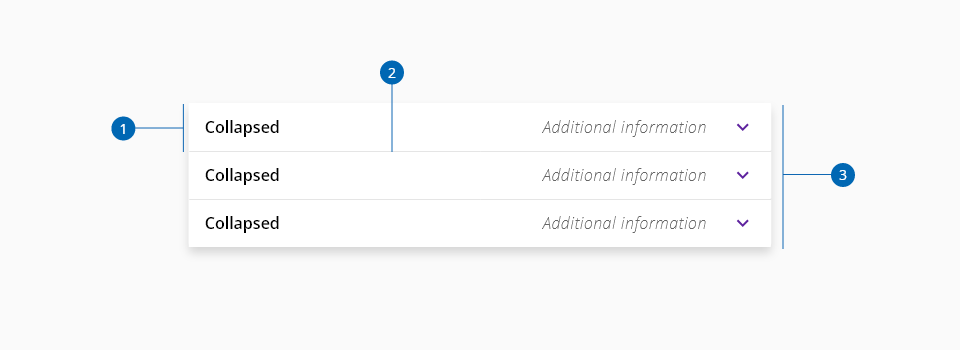
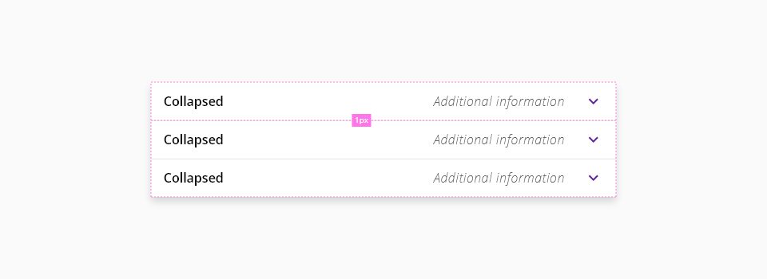

# Accordion group

An accordion group stacks multiple accordions allowing grouped content to be shown or hidden in an organized, cascading manner. 

## Usage

Use an accordion group to organize and display stacked accordions.

### Do’s

* List the elements of an accordion group in a logical manner that users can easily understand 
* Highlight content by displaying an expanded accordion during initial loading

### Dont’s

* Don't divide content into accordion groups when there is not enough content. Look for the best combination of showing and hiding content.
* Don't add accordions to the group and leave them empty

## States

The accordion group has two states: default and disabled. Hover, focus, and active states are handled at the accordion level.

_Default State_

_Disabled State_

## Anatomy

An accordion group can be divided into three major parts: the accordion elements, dividers, and the background container.

## Placement

An accordion group can be placed with main page content or placed inside of a container such as a side panel or tile.

1. Individual accordion element
2. Divider
3. Background container

## Design specifications

_Accordion group specifications_

### Behavior and Interaction

When accordions are expanded within an accordion group their header borders change depending on their stacked position.

_Accordion group specifications_

1. Top rounded header border for the first accordion
2. No header border radius for the middle accordion
3. Bottom rounded header border for the last accordion

## Design Tokens

### Color

| Component token                             | Element                      | Core token                 | Value (HEX)  |
| :------------------------------------------ | :--------------------------- | :------------------------- | :----------- |
| `backgroundColor`                           | Container background         | `color-white`              | #ffffff      |
| `boxShadowColor`                            | Container shadow             | -                          | #0000001a    |
| `accordionGroupSeparatorBorderColor`        | Separator                    | 'color-grey-a-300'         | #CCCCCC      |

### Border

| Component token                             | Element                      | Core token           | Value        |
| :------------------------------------------ | :--------------------------- | :------------------- | :----------- |
| `BorderThickness`                           | Separator                    | `border-width-1`     | 1px          | 

### Spacing

| Property                                    | Element                      | Core token           | Value        |
| :------------------------------------------ | :--------------------------- | :------------------- | :----------- |
| `padding`                                   | Container background         | `spacing-0`          | 0px          | 

## Accesibility

### WCAG 2.2

* Understanding WCAG 2.2 - [SC 2.1.1 Keyboard](https://www.w3.org/WAI/WCAG22/Understanding/keyboard.html)
* Understanding WCAG 2.2 - [SC 4.1.2 Name, Role, Value](https://www.w3.org/WAI/WCAG22/Understanding/name-role-value.html)

### WAI-ARIA 1.2

* WAI-ARIA Authoring Practices 1.2 - [3.1 Accordion (Sections With Show/Hide Functionality)](https://www.w3.org/TR/wai-aria-practices-1.2/#accordion)
* WAI-ARIA Authoring Practices 1.2 - [Accordion Design Pattern](https://www.w3.org/TR/wai-aria-practices-1.2/examples/accordion/accordion.html)

## Links and references

<!--

* [Angular CDK component](url)
* [React CDK component](url)
* [Adobe XD component](url)

____________________________________________________________

* [Edit this page on GitHub](url)
