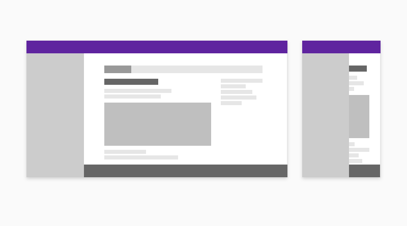
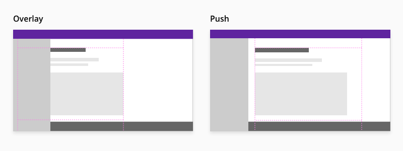

# Application Layout

Application layouts form the structure on which application components are built. Our layouts minimize complexity and focus on facilitating a consistent visual flow across all applications. They are made up of three elements: the header, the main content, and the footer.

## Usage

Application layouts are used to place content across the screen for different applications.

### Layout

_main elements for the web application layout_

_main elements for the tablet and mobile application layout_

### Layout with side navigation

A side navigation can be added as a fourth element to display additional links or information apart from the links that can be displayed as part of the header or footer

## Specifications

### Application Layout Anatomy

1. Header
2. Main content
3. Footer
4. Side Navigation (sidenav)

### Behavior and Interaction

Overlay and push interactions by the sidenav component can alter the way the layout is displayed. For overlay, the sidenav simply slides over the content with no changes to position. Push interaction moves all components to the side depending on the width of the sidenav. 

_Sidenav layout interactions_

## Accessibility

### WAI-ARIA 1.2

* WAI-ARIA Clear Layout and Design [Clear Layout and Design](https://www.w3.org/WAI/perspective-videos/layout/)
* WAI-ARIA Authoring Practices 1.2 - [3.12 Grids - Interactive Tabular Data and Layout Containers](https://www.w3.org/TR/wai-aria-practices/#grid)

## Links

Refer to the following links for more detailed information about each of the layout elements:

* [Header Component](url)
* [Footer Component](url)
* [Sidenav Component](url)

____________________________________________________________

[Edit this page on Github](https://github.com/dxc-technology/halstack-style-guide/blob/master/guidelines/principles/layout/README.md)

