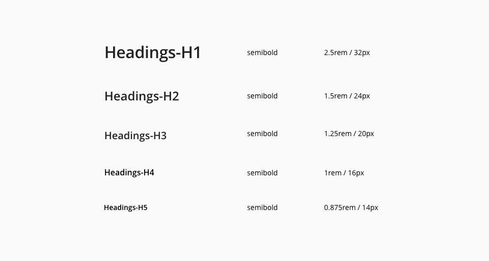

# Heading

Heading component is an essential element that contributes to define a great hierarchy within the application. It helps to give semantic meaning to the content as well as contributing to define a good structure for SEO (search engine optimization). The implementation will rely on the use of HTML tags.
## Usage

Navigating through the `Headings-H1` and `Headings-H3` give a user an overview of a page and how its content is structured. The `Headings-H4` and `Headings-H5` elements provide a quick understanding of the details in each section.

### Do's

* Use `Heading` components from `H1` to `H5` when creating content hierarchy in the page. 
* Use headings for page headings and for specific sections of content.
* Use purposeful words to summarize the content that follows.

### Dont's

* Do not style text to give the visual appearance of headings.
* Avoid "stacking" headings without any body content in between.

## Appearance

The Open Sans typeface has 5 different weights, from light to extra-bold but Halstack use three variations, light, regular and bold. The font size goes from 32 pixels for the `<h1>` heading to 14 pixels for the `<h5>` level.

There are several scenarios where the use of heading is just right when we are talking about the title for a section, header of a table, a definition of the elements that will appear below the title or an introduction for a paragraph. 

## Design tokens

### Color

An inherit color from the definition of the application is received, so the component could change his color based on that parameter. There is no specific color tokens for this component.

### Typography

#### Headings H1

| Property            | Value                     | Token                     | 
| :------------------ | :------------------------ | :------------------------ |  
| `font-family`       | 'Open Sans', sans-serif;  | `font-family-sans`        | 
| `font-weight`       | 600                       | `font-weight-semibold`    | 
| `font-size`         | 32px / 2.5rem             | `font-scale-07`           | 
| `font-style`        | regular                   | `font-normal`             | 
| `text-transform`    | initial                   |                           | 
| `letter-spacing`    | -12.5px / -0.0125em       | `font-tracking-tight-01`  | 

#### Headings H2

| Property            | Value                     | Token                     | 
| :------------------ | :------------------------ | :------------------------ | 
| `font-family`       | 'Open Sans', sans-serif;  | `font-family-sans`        | 
| `font-weight`       | 600                       | `font-weight-semibold`    | 
| `font-size`         | 24px / 1.5rem             | `font-scale-05`           | 
| `font-style`        | regular                   | `font-normal`             | 
| `text-transform`    | initial                   |                           | 
| `letter-spacing`    | 0px / 0em                 | `font-tracking-normal`    | 

#### Headings H3  

| Property            | Value                     | Token                     | 
| :------------------ | :------------------------ | :------------------------ | 
| `font-family`       | 'Open Sans', sans-serif;  | `font-family-sans`        | 
| `font-weight`       | 600                       | `font-weight-semibold`    | 
| `font-size`         | 20px / 1.25rem            | `font-scale-04`           | 
| `font-style`        | regular                   | `font-normal`             | 
| `text-transform`    | initial                   |                           | 
| `letter-spacing`    | 0px / 0em                 | `font-tracking-normal`    | 

#### Headings H4

| Property            | Value                     | Token                     | 
| :------------------ | :------------------------ | :------------------------ | 
| `font-family`       | 'Open Sans', sans-serif;  | `font-family-sans`        | 
| `font-weight`       | 600                       | `font-weight-semibold`    | 
| `font-size`         | 16px / 1rem               | `font-scale-03`           | 
| `font-style`        | regular                   | `font-normal`             | 
| `text-transform`    | initial                   |                           |
| `letter-spacing`    | 0px / 0em                 | `font-tracking-normal`    | 

#### Headings H5

| Property            | Value                     | Token                     | 
| :------------------ | :------------------------ | :------------------------ | 
| `font-family`       | 'Open Sans', sans-serif;  | `font-family-sans`        | 
| `font-weight`       | 600                       | `font-weight-semibold`    | 
| `font-size`         | 14px / 0.875rem           | `font-scale-02`           | 
| `font-style`        | regular                   | `font-normal`             | 
| `text-transform`    | initial                   |                           | 
| `letter-spacing`    | 0px / 0em                 | `font-tracking-normal`    | 

## Accesibility

* Heading components should be in order. That means an `Headings-H1` is followed by an `Headings-H2`, an `Headings-H2` is followed by a `Headings-H2` or `Headings-H3` and so on.
* Keep heading tags consistent. Inconsistently implementing headings can create confusion and frustration for users using assistive technologies.
* Headings are not interactive elements and therefore have no keyboard or pointer interaction.

### WCAG 2.1 Related Success Criterion

* SC 1.3.1 - [Info and relationships](https://www.w3.org/WAI/WCAG21/Understanding/info-and-relationships)
* SC 2.4.6 - [Headings and labels](https://www.w3.org/WAI/WCAG21/Understanding/headings-and-labels.html)

## Links and references

* [React CDK component](https://developer.dxc.com/tools/react/next/#/components/heading)
* [Angular CDK component](https://developer.dxc.com/tools/angular/next/#/components/heading)
* [Adobe XD component](https://xd.adobe.com/view/4c68a380-346b-474b-88da-1005cf2dd54c-193b/)

____________________________________________________________

[Edit this page on Github](https://github.com/dxc-technology/halstack-style-guide/blob/master/guidelines/components/heading/README.md)
