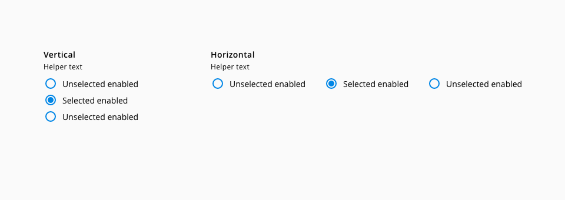

# Radio group

A radio group let the user make a mutually exclusive selection from a group of options.

## Usage

* Labelling should be concise and clearly differentiated with respect to other options.
* One option of the radio group can be pre-selected. Try to select the safest or convenient option.
* Single radio buttons should not be used.
* If the question that the user needs to responde is as easier as yes/no, it is recommended to use a checkbox instead of radio group.


## States

The following states are defined in the life cycle of the component: **Unselected enabled**, **unselected hover** **unselected focus**, **unselected disabled**, **selected enabled**, **selected hover**, **selected focus** and **selected disabled**.


_Radio button states_


The following states are defined in the life cycle of the component: **Enabled**, **error**, **readonly** and **sdisabled**.


_Radio group states_

## Stacking



_Radio button stacking options_

| Name                  | Description           
| :-------------------- | :---------------- 
| Vertical              | Short lists of radio buttons should be stacked vertically below a descriptive label to better associate the group. Options that are listed vertically are easier to read |
| Horizontal            | Multiple radio buttons may be displayed horizontally across the page while keeping them aligned within their respective columns. Here, it is needed to have in consideration that the linear radio buttons represent some challenge, because it's difficult to scan and localize |

*In any case, in the specification it is specified the ideal distance between component with label in the same horizontal edge to avoid the problem of pairing and scannability.

## Anatomy


1. Label
2. Helper text
3. Radio input
4. Radio input label
5. Error message

## Design Specifications


_Component design specifications_

### Color


| Component token                   | Element                  | Core token               | Value       |
| :-------------------------------- | :----------------------- | :----------------------- | :---------- |
| `inputColor`                      | Radio input              | `color-blue-700`         | #0067b3     |
| `hoverInputColor`                 | Radio input:hover        | `color-blue-800`         | #003c66     |
| `focusInputColor`                 | Radio input:focus        | `color-blue-600`         | #0095ff     |
| `activeInputColor`                | Radio input:active       | `color-blue-900`         | #003c66     |
| `errorInputColor`                 | Radio input:error        | `color-red-700`          | #d0011b     |
| `hoverErrorInputColor`            | Radio input:error:hover  | `color-red-800`          | #980115     |
| `activeErrorInputColor`           | Radio input:error:active | `color-red-900`          | #65010e     |
| `disabledInputColor`              | Radio input:disabled     | `color-grey-500`         | #999999     |
| `readonlyInputColor`              | Radio input:readonly     | `color-grey-500`         | #999999     |
| `labelFontColor`                  | Label                    | `color-black`            | #000000     |
| `disabledLabelFontColor`          | Label:disabled           | `color-grey-500`         | #999999     |
| `readonlyLabelFontColor`          | Label: readonly          | `color-black`            | #000000     |
| `helperTextFontColor`             | Helper text              | `color-black`            | #000000     |
| `disabledHelperTextFontColor`     | Helper text:disabled     | `color-grey-500`         | #999999     |
| `inputLabelFontColor`             | Input label              | `color-black`            | #000000     |
| `disabledInputLabelFontColor`     | Input label:disabled     | `color-grey-500`         | #999999     |
| `errorMessage`                    | Error message            | `color-red-700`          | #d0011b     |


### Typography

| Component token           | Element       | Core token              | Value                    |
| :------------------------ | :------------ | :---------------------- | :----------------------- |
| `fontFamily`              | Label         | `font-family-sans`      | 'Open Sans', sans-serif  |
| `fontSize`                | Label         | `font-scale-03`         | 0.875rem / 14px          |
| `fontWeight`              | Label         | `font-weight-semibold`  | 600                      |
| `labelLineHeight`         | Label         | `font-leading-loose-01` | 1.715em                  |
| `fontStyle`               | Label         | `font-style-normal`     | normal                   |
| `fontFamily`              | Helper text   | `font-family-sans`      | 'Open Sans', sans-serif  |
| `fontSize`                | Helper text   | `font-scale-03`         | 0.rem / 16px             |
| `fontWeight`              | Helper text   | `font-weight-regular`   | 400                      |
| `fontStyle`               | Helper text   | `font-style-normal`     | normal                   |
| `helperTextLineHeight`    | Helper text   | `font-leading-normal`   | 1.5em                    |
| `fontFamily`              | Input label   | `font-family-sans`      | 'Open Sans', sans-serif  |
| `fontSize`                | Input label   | `font-scale-03`         | 0.875rem / 14px          |
| `fontWeight`              | Input label   | `font-weight-regular`   | 400                      |
| `fontStyle`               | Input label   | `font-style-normal`     | normal                   |

| Property        | Element        | Token                   | Value           |
| :-------------- | :------------- | :---------------------- | :-------------- |
| `font-size`     | Error message  | `font-scale-01`         | 0.75rem / 12px  |
| `font-weight`   | Error message  | `font-weight-regular`   | 400             |
| `line-height`   | Error message  | `font-leading-normal`   | 1.5em           |

### Border

| Property              | Element                | Core token                 | Value            |
| :-------------------- | :--------------------- | :------------------------- | :--------------- |
| `border-width`        | Radio input            | `border-width-2`           | 2px              |
| `border-style`        | Radio input            | `border-style-solid`       | solid            |
| `border-width`        | Focus border           | `border-width-2`           | 2px              |
| `border-style`        | Focus border           | `border-style-solid`       | solid            |


### Spacing

| Component token             | Element                | Core token                 | Value            |
| :-------------------------- | :--------------------- | :------------------------- | :--------------- |
| `labelMargin`               | Label                  | `spacing-8`               | 0.5rem / 8px     |
| `groupVerticalSpacing`      | Radio                  | `spacing-8`               | 1rem / 16px      |
| `groupHorizontalSpacing`    | Radio                  | `spacing-32`               | 2rem / 32px      |


### Size 

| Property              | Element                   | Value     |  
| :-------------------- | :------------------------ | :-------  | 
| `width`               | Radio input               | 18px      | 
| `width`               | focus outline             | 24px      | 
| `height`              | Radio input               | 18px      | 
| `height`              | focus outline             | 24px      |  

### Margin

Margin can be set independently for `top`, `right`, `bottom`, `left`.

margin | value
-- | --
```xxsmall``` | 6px
```xsmall``` | 16px
```small``` | 24px
```medium``` | 36px
```large``` | 48px
```xlarge``` | 64px
```xxlarge``` | 100px

## Accessibility

### WCAG 2.2

* Understanding WCAG 2.2 - [SC 1.3.1: Info and Relationships](https://www.w3.org/WAI/WCAG22/Understanding/info-and-relationships.html)
* Understanding WCAG 2.2 - [SC 3.3.2: Labels or Instructions](https://www.w3.org/WAI/WCAG22/Understanding/labels-or-instructions.html)
* Understanding WCAG 2.2 - [SC 2.4.6: Headings and Labels](https://www.w3.org/WAI/WCAG22/Understanding/headings-and-labels.html)

### WAI-ARIA 1.2

* WAI-ARIA Authoring Practices 1.2 - [3.12 Radio group](https://www.w3.org/TR/wai-aria-practices-1.2/#radiobutton)


## Links and references

* [React CDK component](https://developer.dxc.com/tools/react/next/#/components/radio)
* [Angular CDK component](https://developer.dxc.com/tools/angular/next/#/components/radio)
* [Adobe XD component](https://xd.adobe.com/view/e7d8044f-9f1e-4350-b66e-3b16217b2c54-b28b/)

____________________________________________________________

[Edit this page on Github](https://github.com/dxc-technology/halstack-style-guide/blob/master/guidelines/components/radio/README.md)
