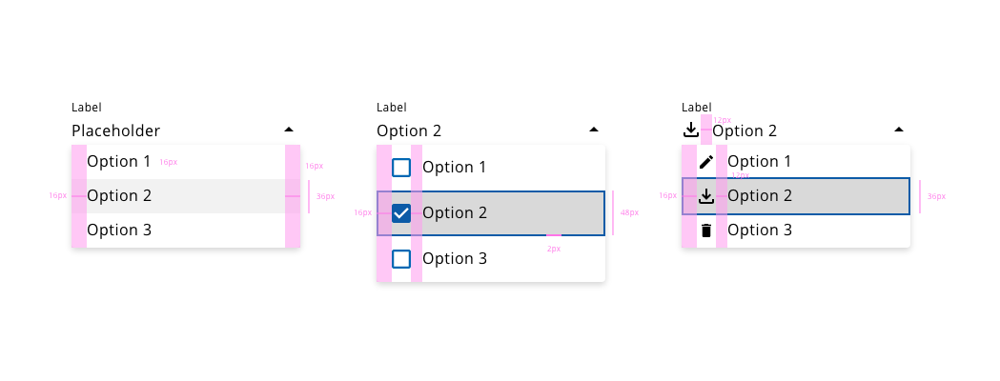

# Select

A select component is a right choice to preventing errors with predefined options, also they reduce the vertical space by showing several options in a reduced space. Selects are used in forms, letting the user select an option instead using an input.

* [Usage](#usage)
* [Appearance](#appearance)
* [States](#states)
* [Design specifications](#design-specifications)
* [Accessibility](#accessibility)
* [Required and error](#required-and-error)
* [Links and references](#links-and-references)

## Usage

### Single select

- A dropdown element should allow the user to select one option from a list.
- The select component should always display a label, different from any name in the option list.
- If the options list is extensive, consider letting the user type for suggestions filtering the whole number of options.
- A default choice can be displayed as the placeholder before user selection. It must be placed as the first item on the options list and appear selected.
- Use progressive disclosure between linked select components.

### Multi-select

- If more than one option is applicable, a multi-selection box should be used.
- If the list of options is short (4 or less) and users can select more than one option, consider using checkboxes instead of a multi-selection list for simplicity and visual clarity.
- Multi-select fields include checkboxes for every single option in the list, the entire row must be clickable.


## Appearance

Select is widely recognizable, despite the options are not shown at the first instance, an icon with a down arrow indicates that clicking in the field the list will be visible. In the input, the placeholder defines the attribute that will get the value. 

* The options list will be displayed immediately above the placeholder, to get visible all the time which form fill attribute is the user filling.
* In case that an option is selected when the dropdown turns visible, it should be at the top of the dropdown whenever this would be possible.
* Multiple option selection will get an appearance with a checkbox that indicates the elements from the list that are selected or not.


## States

### Select input

States are defined for select component based on the interactions that the user can reproduce. The states are: **enabled**, **focus**, **error** and **disabled**:


### Options list

The options have two states: **enabled**, **hover**, **focus** and **selected**:


### Multiple selection

Allows the user to select more than one option from the list. To indicate which items are selected and which not, the design for multiple selections integrates a checkbox pairing with each option from the dropdown.


## Design Specifications

### General

#### Color

| Tokens                          | Value       |
| -----------------------------   | ----------- |
| `selectedOptionBackgroundColor` |     #D9D9D9 |
| `color`                         |     #000000 |
| `hoveredOptionBackgroundColor`  |     #F2F2F2 |
| `error`                         |     #D0011B |
| `scrollBarThumbColor`           |     #666666 |
| `scrollBarTrackColor`           |     #D9D9D9 |
| `disabledColor`                 |     #B1B1B1 |
| `focusColor`                    |     #005FCC |

#### Size

The component `width` can adopt the following values:

width | value
-- | --
```small``` | 60px
```medium``` | 240px
```large``` | 480px
```fillParent``` | -

#### Margin

Select `margin` can use the values:

margin | value
-- | --
```xxsmall``` | 6px
```xsmall``` | 16px
```small``` | 24px
```medium``` | 36px
```large``` | 48px
```xlarge``` | 64px
```xxlarge``` | 100px

These values can be applied independently to each side of the component:
```top``` ```bottom``` ```left``` ```right```

### Select input

Select input specifications are the same as the [text-input](https://developer.dxc.com/design/components/text-input)

### Options list

#### Single select

| Property for single     |                           Value |
| ----------------------- | ------------------------------ |
| List item `padding-left`      |            16px |
| `height`                  |     36px |
| `font-size`               |                          16px |
| `font-weight`             |                       Regular |
| Icon size               |                    20 x 20px|
| Spacing between icon and label | 12px  |
| Focus outline `border-width` |  2px |

#### Multi-select

| Property for multiple   |                 Value |
| ----------------------- | -------------------- |
| List item `padding-left`      |            16px |
| `height`                  |     48px |
| `font-size`               |                          16px |
| `font-weight`             |                       Regular |
| Icon size               |                    20 x 20px|
| Spacing between checkbox and label | 12px  |
| Spacing between icon and label | 12px  |
| Focus outline `border-width` |  2px |




## Accessibility

### WCAG 2.2

**Understanding WCAG 2.2** - [SC 3.2.2: On Input](https://www.w3.org/WAI/WCAG22/Understanding/on-input.html)

* Changing the setting of any user interface component does not automatically cause a change of context unless the user has been advised of the behavior before using the component.

### WAI-ARIA 2.1 

**WAI-ARIA practices 2.1** - [3.14 Listbox](https://www.w3.org/TR/wai-aria-practices-1.2/#Listbox)

* An element that contains or owns all the listbox options has role `listbox`.
* Each option in the listbox has role `option` and is a DOM descendant of the element with role listbox or is referenced by an `aria-owns` property on the listbox element.
* If the listbox is not part of another widget, then it has a visible label referenced by `aria-labelledby` on the element with role listbox.
* In a single-select listbox, the selected option has `aria-selected` set to true.
* If the listbox supports multiple selection:
  * The element with role `listbox` has `aria-multiselectable` set to true.
  * All selected options have `aria-selected` set to true.
  * All options that are not selected have `aria-selected` set to false.
* If the complete set of available options is not present in the DOM due to dynamic loading as the user scrolls, their `aria-setsize` and `aria-posinset` attributes are set appropriately.
* If options are arranged horizontally, the element with role `listbox` has `aria-orientation` set to horizontal. The default value of `aria-orientation` for listbox is vertical.


## Required and error

* A required empty select should show an error message when submitted.
* Helper text can be added to the component, [specs](https://developer.dxc.com/design/components/text-input) are available in the input component.


## Links and references

- https://xd.adobe.com/view/23e2cca4-5021-490a-a548-e99a9b4a2006-76b1/screen/5d47790c-8718-4e0a-acc4-3deea3a0a8fa/variables/

____________________________________________________________

[Edit this page on Github](https://github.com/dxc-technology/halstack-style-guide/blob/master/guidelines/components/select/README.md)

