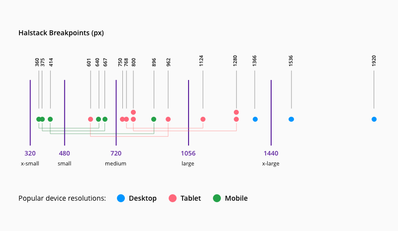

# Layout

## Grid

The grid provides the foundation for consistently positioning elements onscreen. The 8x Grid is the geometric foundation of all the visual elements of Halstack Design System from typography to columns, boxes, icons, and illustrations. It provides structure and guidance for all creative decision-making.

### Grid Usage
- Use multiples of 8px when defining measurements, spacing, and positioning elements.
- When necessary use 4px to make more fine tuned adjustments.
- Whenever possible, make sure that objects line up, both vertically and horizontally.
- Align your bounding box to the grid, not the baseline of your text.

## Breakpoints

Breakpoints define resolutions at which screen components adjust to offer an optimal user experience across screen sizes and devices. We've defined five different breakpoints to accommodate multiple web, tablet, and mobile screen resolutions. The image below illustrates how we've used data on the most popular screen resolutions by device over the past few years to help define each breakpoint.

_Halstack breakpoints vs popular device resolutions_

## Columns, Margins, and Gutters

Columns, gutters, and margins make up the responsive layout grid following these breakpoints. Depending on resolution and screen size of a device, column numbers and the values of the margins and gutters adjust to accommodate all screen elements in the most optimal manner.

- Columns are the areas of the screen where content is placed. 
- A gutter is the space between columns used to separate content.
- Margins are the space between content and the left and right edges of the screen.

_x-large breakpoint at 1440px width with 8 columns_

_medium and small breakpoint layouts for tablets and mobile devices both utilizing 4 columns_

The following table describes the columns, margins, and gutter at each of the different breakpoints:

| Breakpoint   | px / rem    | Columns     | Gutter (recommended 1)   | Margin (min)2   |
| :----------- | :---------- | :---------- | :------- | :------- |
| x-small      | 320 / 20    |      4      |    16 / small   | 24      | 
| small        | 480 / 30    |      4      |    16 / small   | 24       | 
| medium       | 720 / 45    |      4      |    24 / medium   | 48       | 
| large        | 1056 / 66   |      8      |    16 / small  | 56       | 
| x-large      | 1440 / 90   |      8      |    24 / medium  | 56       | 

1. Any value provided by the gutter prop in the layout components can be used altought we recommend to stick to the values provided.
2. The margin value provided are the minimun recommended, any value from our [spacing scale](#) can be used or even an auto value.
## Layout components

* Application layout
* Stack
* Row
* Bleed
* Inset

____________________________________________________________

[Edit this page on Github](https://github.com/dxc-technology/halstack-style-guide/blob/master/guidelines/principles/layout/README.md)
